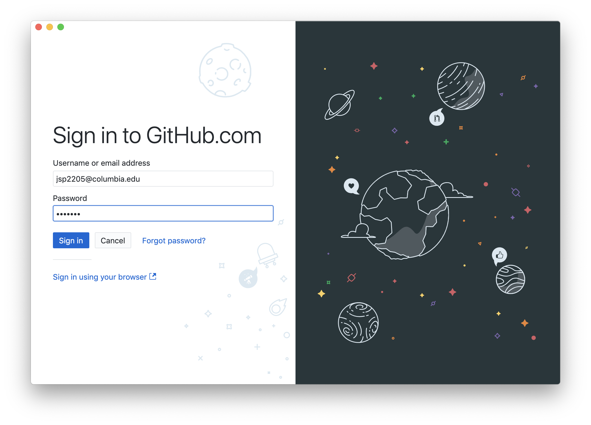
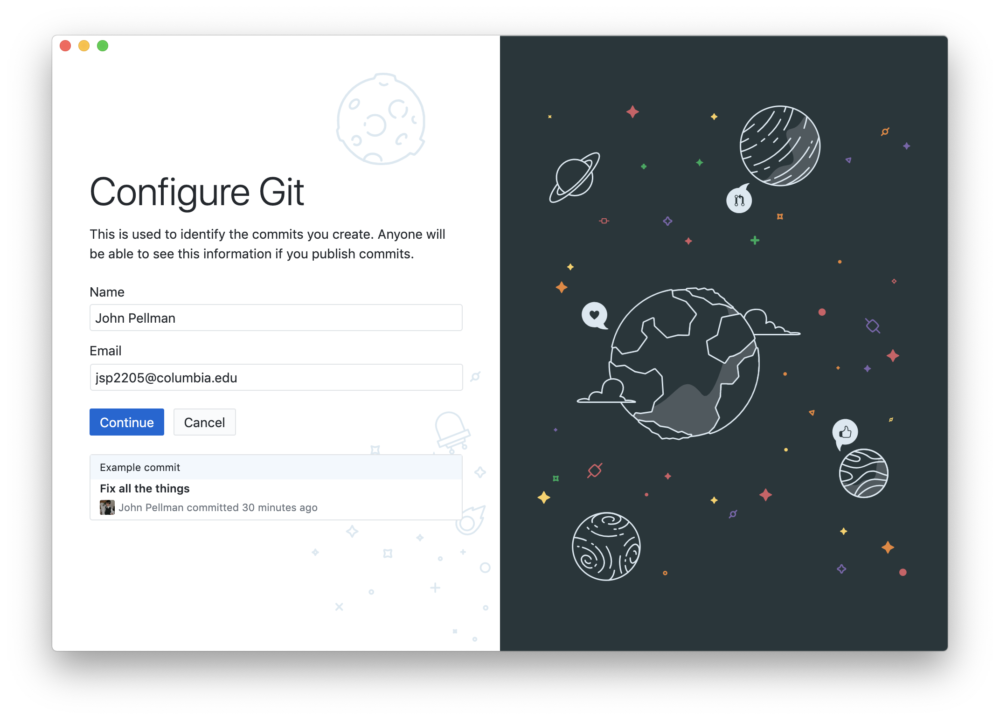
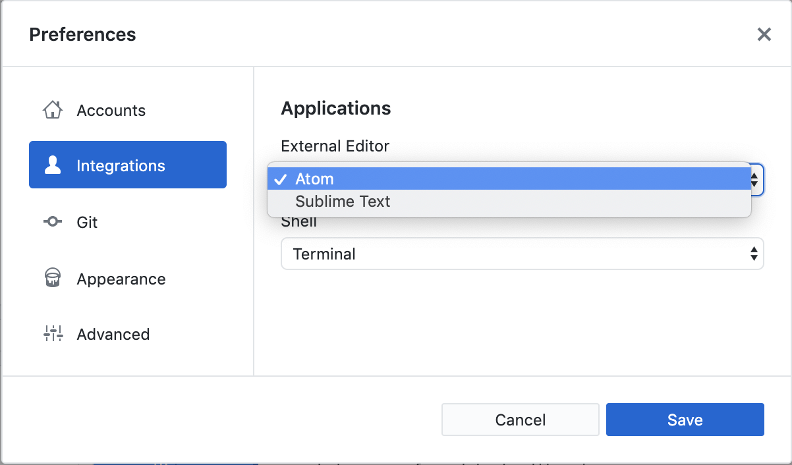

When we use GitHub Desktop on a new computer for the first time,
we need to configure a few things. Below are a few examples
of configurations we will set as we get started with Git:

*   our name and email address,
*   and what our preferred text editor is (for the rest of this tutorial, this will be [Atom](https://atom.io/), but we will show you how to change this)

If you haven't set up a GitHub account already, please do so now by following the instructions [here](https://help.github.com/en/github/getting-started-with-github/signing-up-for-a-new-github-account).  You will initially want to sign up for the free tier.  GitHub will send you a verification e-mail with a link that you should click on after setting up your account.  We also highly recommend that you set up two-factor authentication, which provides greater security for your account.  Instructions on how to set up two-factor authentication with GitHub can be found [here](https://help.github.com/en/github/authenticating-to-github/configuring-two-factor-authentication).

Once you are sure that your GitHub account is set up properly, open the GitHub Desktop application.  Click *Sign in to GitHub.com*.  Type in your username and password when prompted or alternatively use the *Sign in using your browser* link if you are already logged in using a web browser.  If you are using two-factor authentication, you will be asked to provide an authentication code from your phone at this point.

GitHub Desktop will then ask you to enter your name and email address.  This user name and email will be associated with your subsequent Git activity,
which means that any changes to documents or code that you upload to
[GitHub](https://github.com/) or
another Git host server
in a later lesson will include this information.

The email address used should be the same as the one used when setting up your GitHub account unless you are concerned about privacy. If you do have privacy concerns, please review [GitHub's instructions for keeping your email address private][git-privacy].  If do you elect to use a private email address with GitHub, then use that same email address for the _**Email**_ field (e.g. *username@users.noreply.github.com* replacing *username* with your GitHub one).  Choosing to keep your email address private has the advantage that you will be less targeted by spammers, but with the caveat that other researchers will not be able to find contact information for you as readily.

## Changing Your Text Editor

It is possible to reconfigure the text editor for GitHub Desktop whenever you want to change it.  To do so, navigate to the *Preferences* pane within the GitHub Desktop application.  Instructions for how to do this can be found [here](https://help.github.com/en/desktop/getting-started-with-github-desktop/configuring-basic-settings).

Once you are in the *Preferences* pane, click on *Integrations* and then select your favorite text editor in the dropdown under *External Editor*.

[git-privacy]: https://help.github.com/articles/keeping-your-email-address-private/
