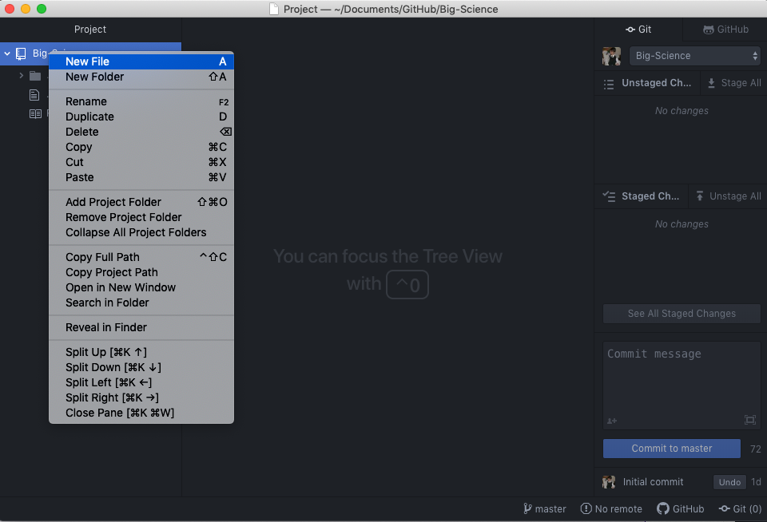
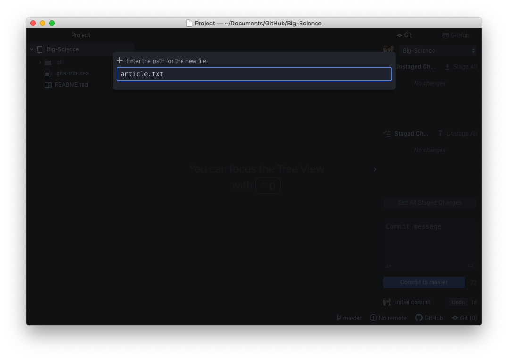
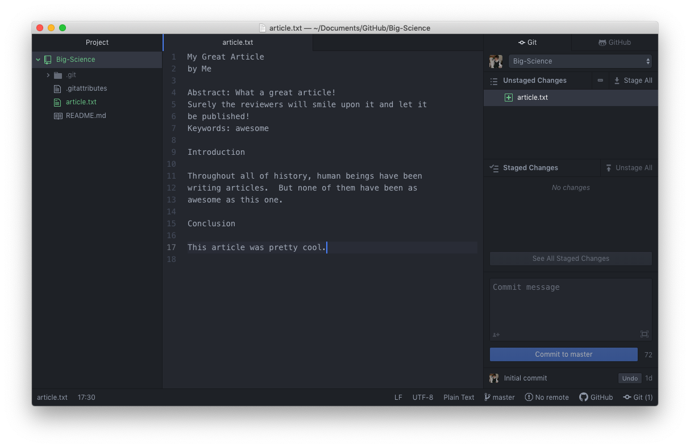
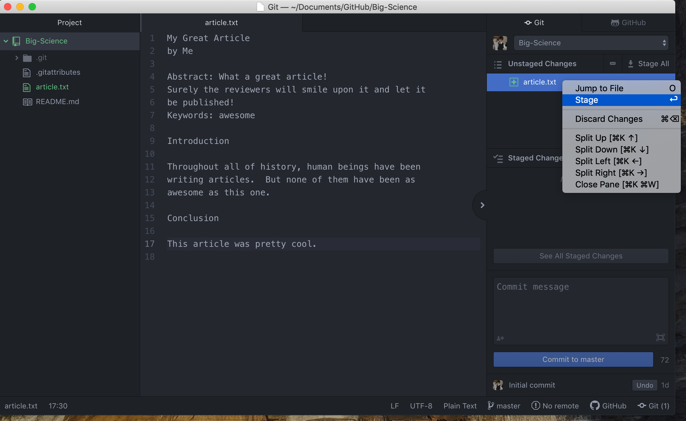
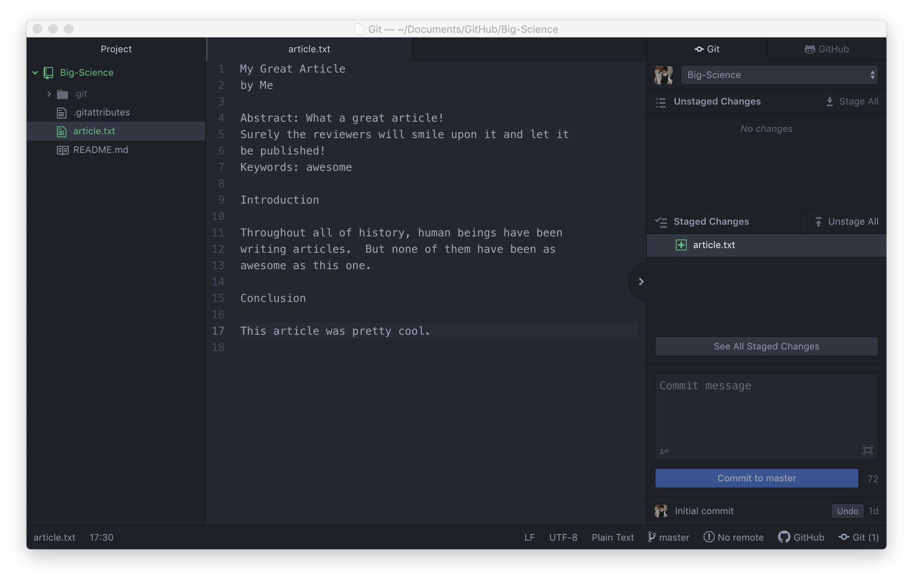
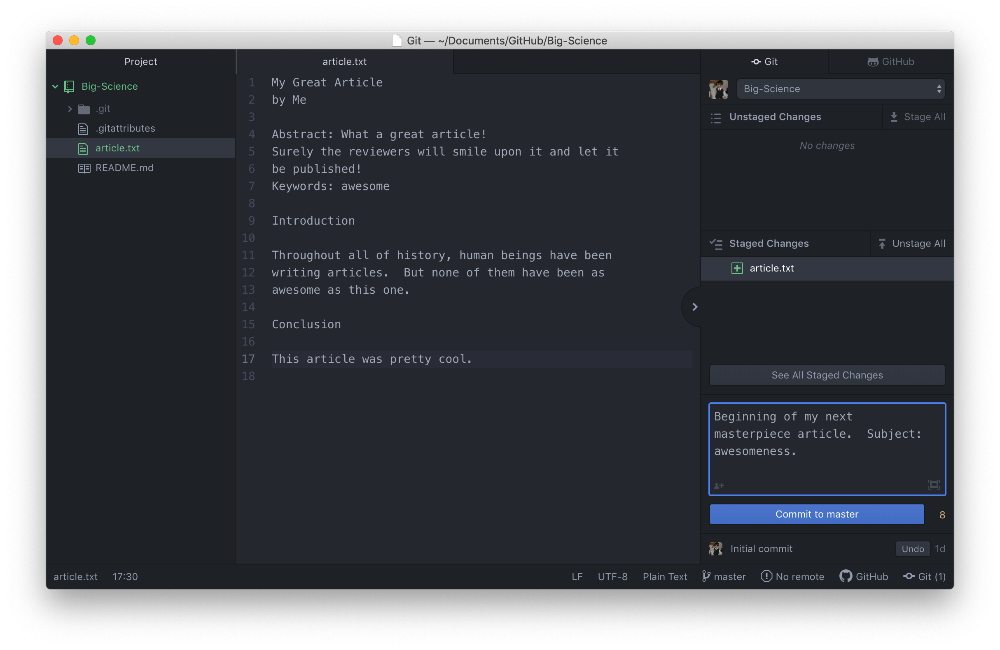
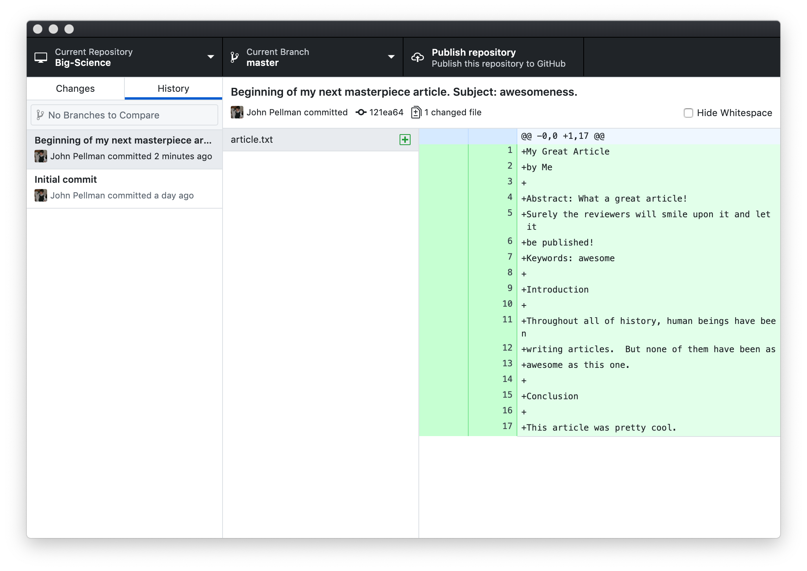
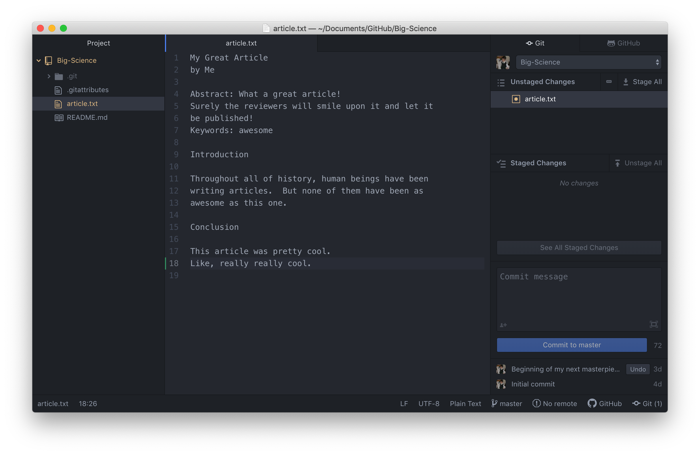
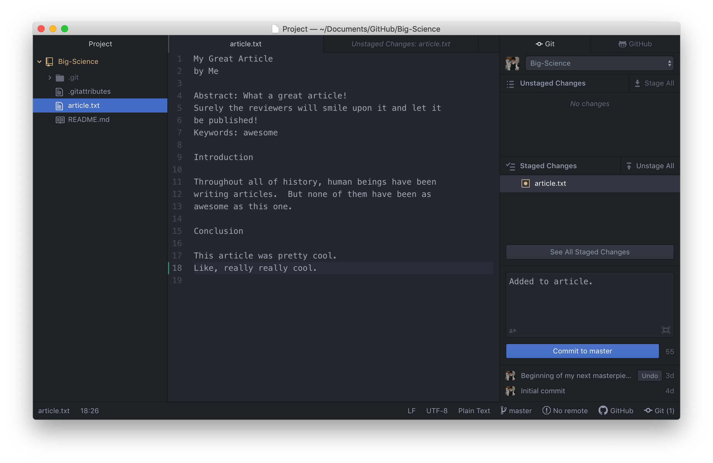
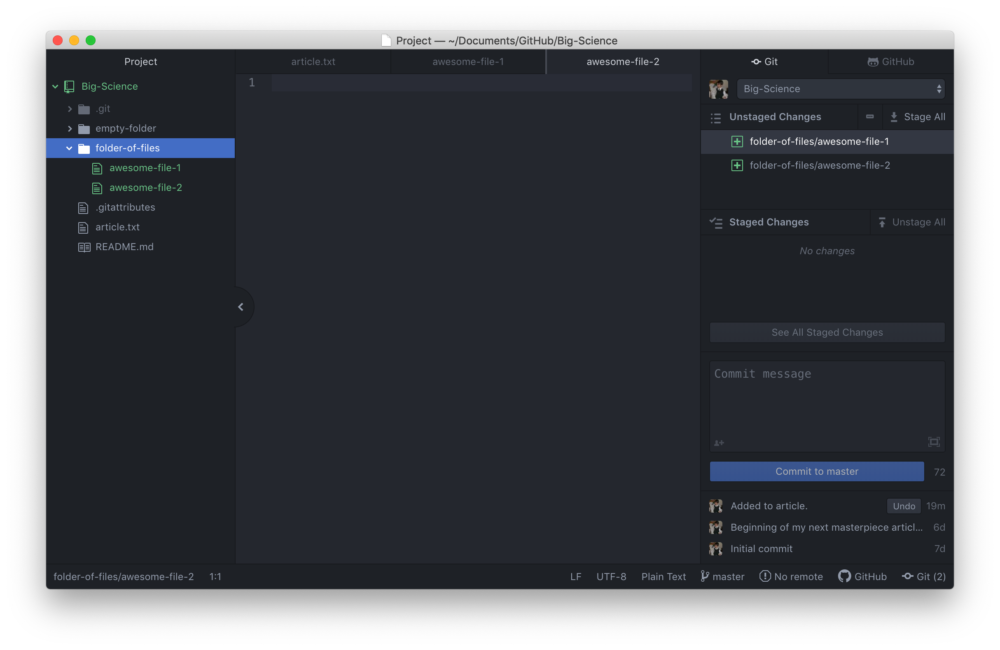

Let's return to the repository we just created (*Big-Science*) and start tracking changes to a hypothetical article that we'd like to get published within the next couple of months.

First, let's right-click on *Big-Science* in the left pane followed by *New File*.  Alternatively, you can type <kbd>a</kbd> while inside the Atom window.

You will then be prompted for a filename to use for the document you want to create.  In this example, we'll use `article.txt`.

Now, type some text into your new article:

Notice that in the right pane of the text editor, Git has noticed that the document has changed.  The Git extension in the right pane of the editor allows us to see the status of our Git repository.  As mentioned earlier, when changes are made to a file or a new file is created, and Git is unsure if the changes are meant to be enduring the file is said to be in an [unstaged]({{ page.root }}#staging) state.

> ## The Git Staging Area and Commits: A Photography Metaphor
>
> You can think of staging as similar to assembling a group of people
> for a photograph.  For certain photos, you may only want to highlight certain
> groups of people (e.g., separating people by grade or extracurricular in your
> high school yearbook).  Every time you move changed files from being unstaged
> into the staging area, it's as though you are putting together a logical grouping
> of people within a camera frame.
>
> In Git's terminology, [committing]({{ page.root }}#commit) is the act
> of taking changes that have been staged and then confirming that those changes (which are
> also referred to as a [changeset]({{ page.root }}#changeset)) are
> changes that we want to have recorded in the history of edits that we have made to a document
> or computer program.  Essentially, committing staged changes in a Git repository is
> like taking a photograph and then adding it to a chronological album.
>
> Conceptually, this can be represented in the diagram below, where `git add` indicates
> the transition between unstaged and staged files and `git commit` indicates the transition
> between staged and committed files.  Throughout this process, the `.git` directory
> we discussed earlier is analogous to the aforementioned chronological album.
{: .callout}

We can stage files that have changed in out Git repository by right-clicking on the file on the right pane and then clicking *Stage*.  Alternatively, we can select the file the in the right pane by clicking on it and then type <kbd>Enter</kbd> or <kbd>Return</kbd> to stage it.

Once the file is staged, it will be listed under the *Staged Changes* section of the Git pane.

If we've decided that these changes are changes we want recorded, then we can create a [commit]({{ page.root }}#commit)
(or [revision]({{ page.root }}#revision)) by typing in a descriptive message and
pressing *Commit to master*.

[Good commit messages][commit-messages] start with a brief (<50 characters) statement about the
changes made in the commit. Generally, the message should complete the sentence "If applied, this commit will" <commit message here>.
If you want to go into more detail, add a blank line between the summary line and your additional notes. Use this additional space to explain why you made changes and/or what their impact will be.

If we decide that we actually don't want to keep track of a change, we can also right-click on a file in the staging area and unstage it.  If we accidentally make a commit that we don't want, Git also gives us the ability
to undo that commit by clicking the undo button in the lower right corner.

After we've committed our changes, we can navigate back to the GitHub Desktop application,
click on the history tab and see a history of each commit that we've made, and the lines of
text that we added or subtracted from our text file or program.

If you look next the text that says *John Pellman committed*, you'll notice a short alphanumeric code (such as `121ea64`).  This code is a unique identifier for each commit that is made in the Git repository.

If we add more text to our article after we've committed, you'll notice that the new changes appear in the unstaged changes portion of the right pane in Atom.  We can then go through and repeat the process of staging the changes and then committing them to the Git repository.  

If we click on the unstaged file in the right pane, it will show us exactly which lines were added:

After reviewing our change, it's time to stage and commit it:

If we create a folder of new files in our repository, those files will also show up as unstaged changes
in the right pane.  Note that empty folders are not noticed by Git.  This is because Git operates
by tracking changes relative to an original base document, and anything that is not a file
is not scrutinized by Git.

To stage all of the files in `folder-of-files` at the same time, we can use the *Stage All* button, and then commit them.

To recap, when we want to add changes to our repository,
we first need to add the changed files to the staging area using the Git Atom extension in the right pane
(depicted via `git add` arrow below) and then commit the staged changes to the
repository (depicted via `git commit` arrow below):

[commit-messages]: https://chris.beams.io/posts/git-commit/


