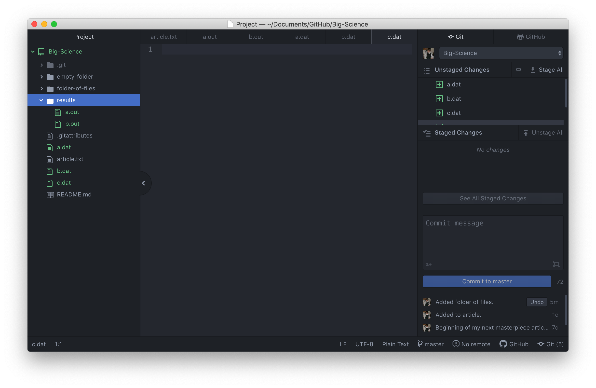
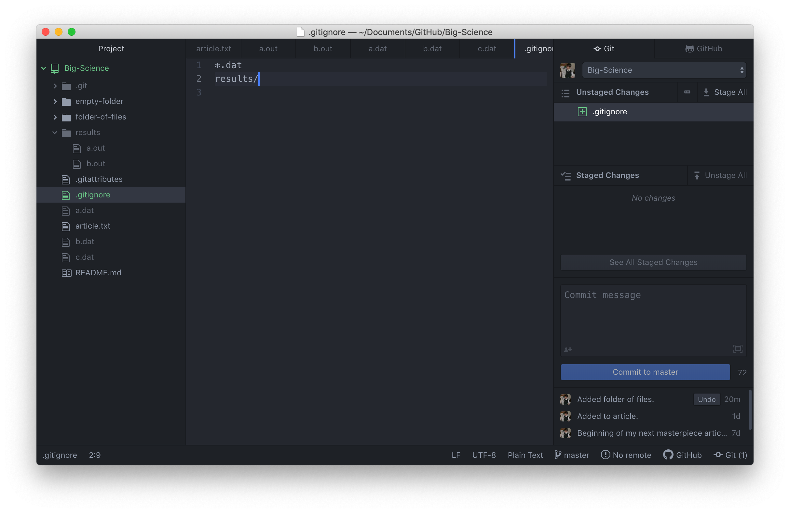
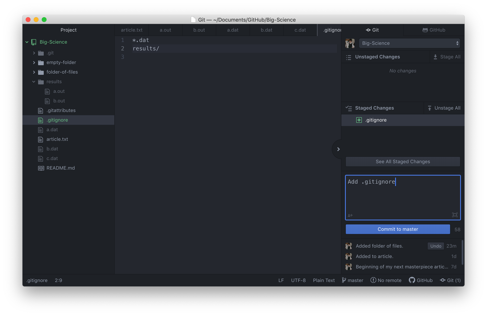
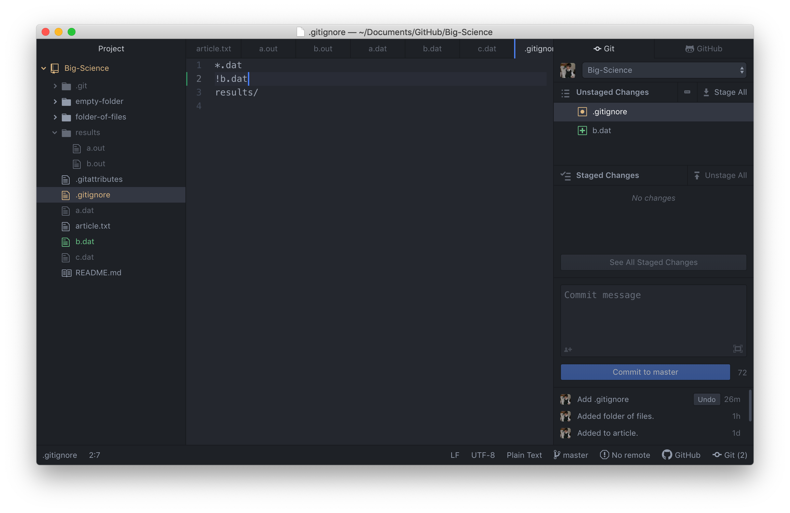

Generally speaking, Git does not handle files that are not text-based.
This is because Git operates by storing the accumulated differences between lines of text
as a file is changed, and assumes that the data contained within a file is text-based.

While it is possible to make comparisons of differences in lines of the binary 0s and 1s
present in non-text files, such differences are irregular, and incur substantial overhead that
can make Git very slow.

For this reason, unless you are using a specialized extension like [git-annex](https://git-annex.branchable.com/)/[DataLad](https://www.datalad.org/)
or [git-lfs](https://git-lfs.github.com/), you will want to tell your Git repository to ignore large
binary files (such as TIFFs, NifTIs, HDF5, and other scientific data formats).  A full treatment of
Git extensions that deal with binary data is out of scope for the present session, though you may want
to keep the extensions mentioned above if tracking changes to large, non-text datasets is of interest to you.

There may also be other files that we do not want Git to track for us,
like backup files created by our editor,
or intermediate files created during data analysis.

To see how we would deal with these, let's first create a few dummy files.  Right-click on *Big-Science* in the left pane to make a new folder named *results*.
Then, create 2 output files within *results*.  Name these `a.out` and `b.out`.
Finally, create 3 data files named `a.dat`, `b.dat`, and `c.dat` and nest them under the main
directory.

When you're done, your Atom window should look something like this:

Let's pretend that these files are all in binary formats, and that we do not want them to be
tracked by Git.  In this scenario, we're not interested in tracking changes to data,
we're more interested in tracking changes to our paper (or perhaps some code).

We can tell Git to not track files within our project by creating a special file in the root directory of our project called `.gitignore`.

Were these files under version control would be a waste of disk space.
What's worse,
having them all listed could distract us from changes that actually matter,
so let's tell Git to ignore them.

We can paste the following [glob patterns](https://en.wikipedia.org/wiki/Glob_(programming)) into
`.gitignore` (Git uses its own flavor of glob patterns described [here](https://git-scm.com/docs/gitignore#_pattern_format)):   

~~~
*.dat
results/
~~~
{: .output}

Glob patterns are a way to select multiple files whose filenames conform to a specific textual structure.
They tell Git to ignore any file whose name ends in `.dat`
and everything in the `results` directory.
If any of these files were already being tracked,
Git would continue to track them.

Once we have created this file,
the unstaged changes panel is much cleaner:

The only thing Git notices now is the newly-created `.gitignore` file.
You might think we wouldn't want to track it,
but everyone we're sharing our repository with will probably want to ignore
the same things that we're ignoring.
Let's add and commit `.gitignore`:

However, what if we actually want to track `b.dat` while still ignoring the other
files that end in `.dat`?  You can tell `.gitignore` to continue tracking files
that would otherwise be ignored by adding a line starting with `!` followed by the file's
name or another glob pattern:

~~~
*.dat
!b.dat
results/
~~~
{: .output}

The patterns defined in `.gitignore` are considered in sequence, which means that `!b.bat` will
override `*.dat` since it is defined later.

After saving `.gitignore`, we see that `b.dat` now shows up again in the unstaged changes panel:

> ## Ignoring Nested Files
>
> Given a directory structure that looks like:
>
> ~~~
> results/data
> results/plots
> ~~~
> {: .language-bash}
>
> How would you ignore only `results/plots` and not `results/data`?
>
> > ## Solution
> >
> > If you only want to ignore the contents of
> > `results/plots`, you can change your `.gitignore` to ignore
> > only the `/plots/` subfolder by adding the following line to
> > your .gitignore:
> >
> > ~~~
> > results/plots/
> > ~~~
> > {: .output}
> >
> > This line will ensure only the contents of `results/plots` is ignored, and
> > not the contents of `results/data`.
> >
> > As with most programming issues, there
> > are a few alternative ways that one may ensure this ignore rule is followed.
> > The "Ignoring Nested Files: Variation" exercise has a slightly
> > different directory structure
> > that presents an alternative solution.
> > Further, the discussion page has more detail on ignore rules.
> {: .solution}
{: .challenge}

> ## Including Specific Files
>
> How would you ignore all `.dat` files in your root directory except for
> `final.dat`?
>
> > ## Solution
> >
> > You would add the following two lines to your .gitignore:
> >
> > ~~~
> > *.dat           # ignore all data files
> > !final.dat      # except final.data
> > ~~~
> > {: .output}
> >
> > The exclamation point operator will include a previously excluded entry.
> >
> > Note also that because you've previously committed `.dat` files in this
> > lesson they will not be ignored with this new rule. Only future additions
> > of `.dat` files added to the root directory will be ignored.
> {: .solution}
{: .challenge}

> ## Ignoring Nested Files: Variation
>
> Given a directory structure that looks similar to the earlier Nested Files
> exercise, but with a slightly different directory structure:
>
> ~~~
> results/data
> results/images
> results/plots
> results/analysis
> ~~~
> {: .language-bash}
>
> How would you ignore all of the contents in the results folder, but not `results/data`?
>
> Hint: think a bit about how you created an exception with the `!` operator
> before.
>
> > ## Solution
> >
> > If you want to ignore the contents of
> > `results/` but not those of `results/data/`, you can change your `.gitignore` to ignore
> > the contents of results folder, but create an exception for the contents of the
> > `results/data` subfolder. Your .gitignore would look like this:
> >
> > ~~~
> > results/*               # ignore everything in results folder
> > !results/data/          # do not ignore results/data/ contents
> > ~~~
> > {: .output}
> >
> {: .solution}
{: .challenge}

> ## Ignoring all data Files in a Directory
>
> Assuming you have an empty .gitignore file, and given a directory structure that looks like:
>
> ~~~
> results/data/position/gps/a.dat
> results/data/position/gps/b.dat
> results/data/position/gps/c.dat
> results/data/position/gps/info.txt
> results/plots
> ~~~
> {: .language-bash}
>
> What's the shortest `.gitignore` rule you could write to ignore all `.dat`
> files in `result/data/position/gps`? Do not ignore the `info.txt`.
>
> > ## Solution
> >
> > Appending `results/data/position/gps/*.dat` will match every file in `results/data/position/gps`
> > that ends with `.dat`.
> > The file `results/data/position/gps/info.txt` will not be ignored.
> {: .solution}
{: .challenge}

> ## The Order of Rules
>
> Given a `.gitignore` file with the following contents:
>
> ~~~
> *.dat
> !*.dat
> ~~~
> {: .language-bash}
>
> What will be the result?
>
> > ## Solution
> >
> > The `!` modifier will negate an entry from a previously defined ignore pattern.
> > Because the `!*.dat` entry negates all of the previous `.dat` files in the `.gitignore`,
> > none of them will be ignored, and all `.dat` files will be tracked.
> >
> {: .solution}
{: .challenge}

> ## Log Files
>
> You wrote a script that creates many intermediate log-files of the form `log_01`, `log_02`, `log_03`, etc.
> You want to keep them but you do not want to track them through `git`.
>
> 1. Write **one** `.gitignore` entry that excludes files of the form `log_01`, `log_02`, etc.
>
> 2. Test your "ignore pattern" by creating some dummy files of the form `log_01`, etc.
>
> 3. You find that the file `log_01` is very important after all, add it to the tracked files without changing the `.gitignore` again.
>
> 4. Discuss with your neighbor what other types of files could reside in your directory that you do not want to track and thus would exclude via `.gitignore`.
>
> > ## Solution
> >
> > 1. append either `log_*`  or  `log*`  as a new entry in your .gitignore
> > 3. track `log_01` using   `git add -f log_01`
> {: .solution}
{: .challenge}
