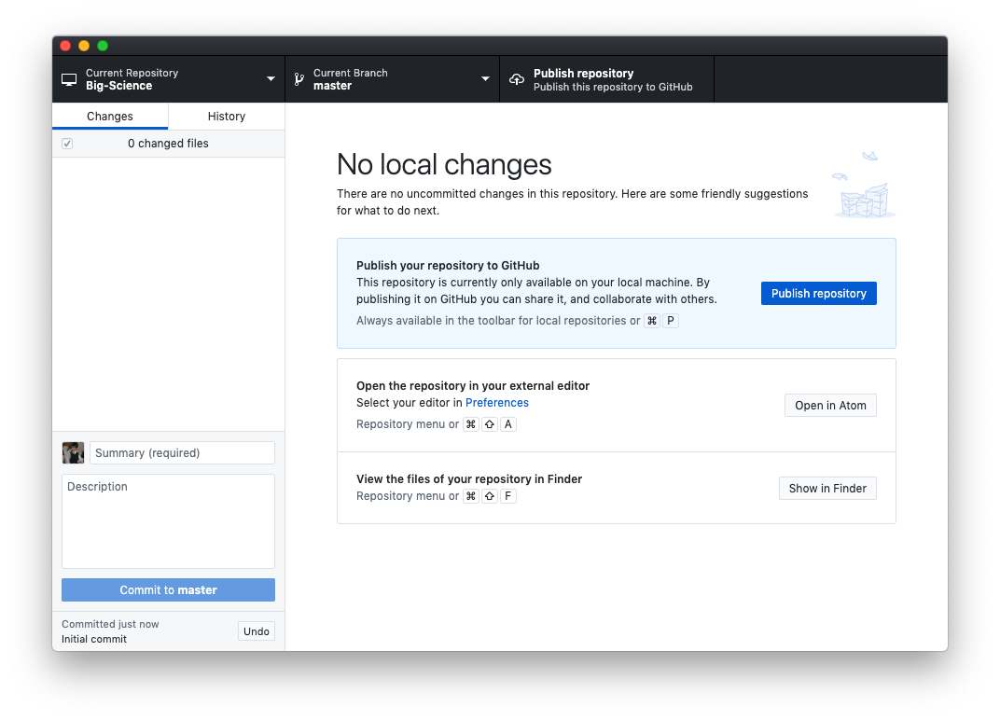
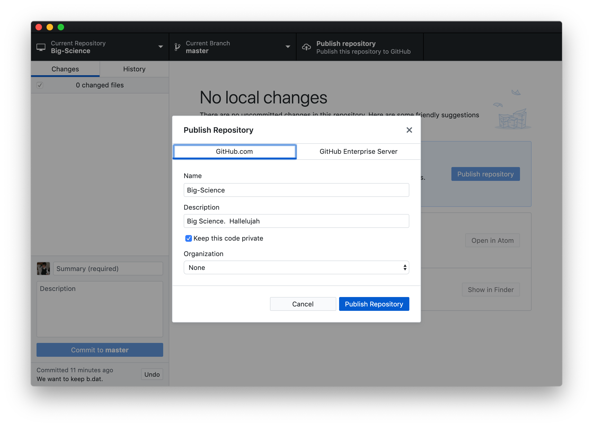
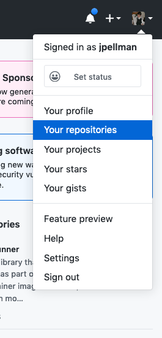
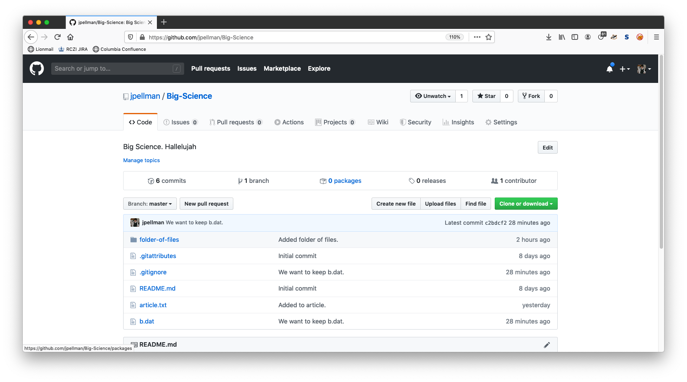
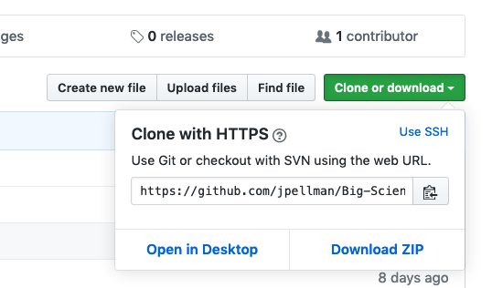
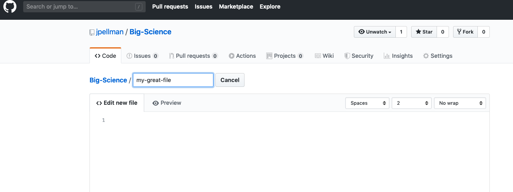
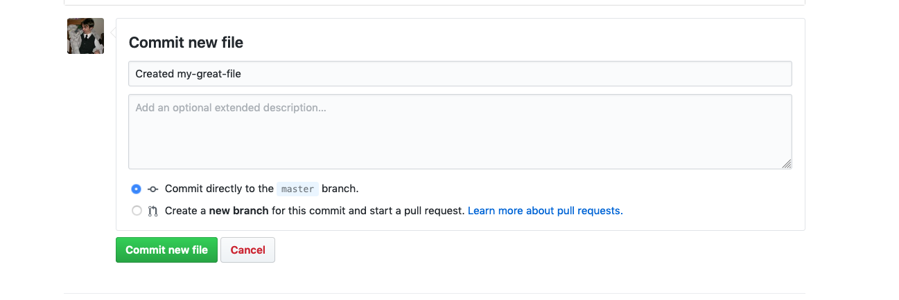
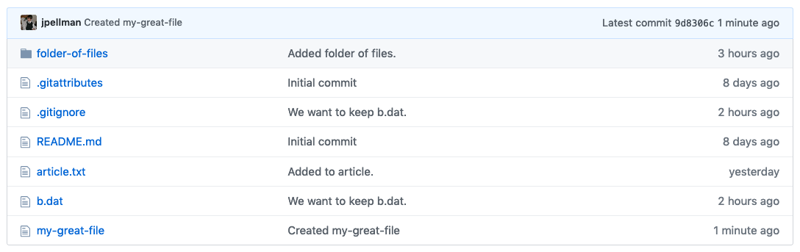
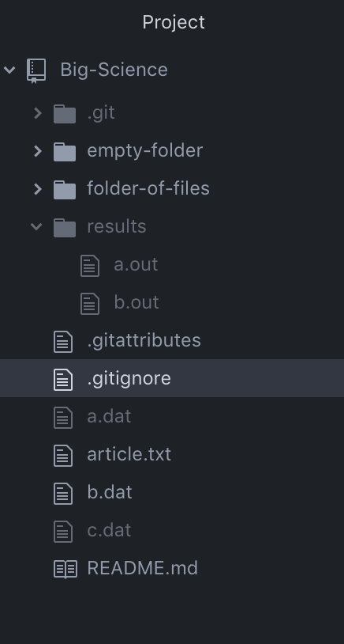
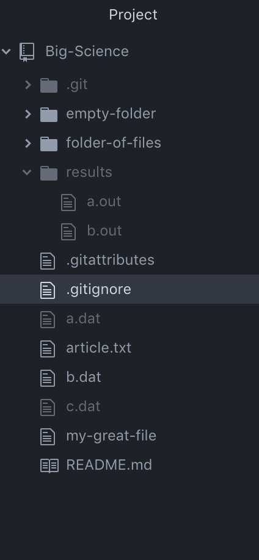

Version control really comes into its own when we begin to collaborate with
other people.  We already have most of the machinery we need to do this; the
only thing missing is to copy changes from one repository to another.

Systems like Git allow us to move work between any two repositories.  In
practice, though, it's easiest to use one copy as a central hub, and to keep it
on a server on the internet rather than on someone's laptop or workstation.
Such a centralized copy of a Git repository is referred to as a [remote]({{ page.root }}#remote) repository.

Remote repositories can exist in any location that is accessible over a network.
They can live on a general file server such as [Engram](https://confluence.columbia.edu/confluence/display/zmbbi/Engram%3A+Research+Data+Storage) or on a website.  Alternatively, a remote repository could live on a web server on the moon (so long as your interplanetary internet is set up correctly; make sure that your PC is able to speak [Licklider Transmission Protocol](https://en.wikipedia.org/wiki/Licklider_Transmission_Protocol) and [CFDP](https://en.wikipedia.org/wiki/CCSDS_File_Delivery_Protocol) before attempting this).
In general, most programmers find that using third-party hosting
services like [GitHub](https://github.com), [Bitbucket](https://bitbucket.org) or
[GitLab](https://gitlab.com/) is the most practical way hold those master copies.  Since we are working
with GitHub Desktop in these examples, we will proceed with GitHub.  A more thorough treatment of the
advantages and disadvantages of various hosting providers will be given later on in the [Hosting]({{ page.root }}) section.

> ## Multiple Remotes
>
> While it's standard practice to have only *one* central copy, it's also possible to send copies
> of your Git repository from your workstation to multiple servers or websites.
> For instance, you could send changes to copies of your repository in both GitHub and GitLab.
> This can be useful if you want a backup copy of your central repository to be available if
> the server hosting your remote repository is offline or otherwise inaccessible (e.g., GitHub may go down, but GitLab would still be available).
>
> Each remote in a Git repository has its own unique local name.  By convention, the main centralized
> copy is called `origin`.
>
> For the purposes of this tutorial, we will only be dealing with one remote repository.
{: .callout}

Let's start by switching back to the GitHub Desktop application.  Your window should look something like the following:

If it does not, then click *Current Repository* in the upper left corner and ensure that *Big-Science* is selected.

Next click on either the blue button that says *Publish repository* or the rightmost button in the top bar of the window with the same text.  You will then be presented with the following dialogue:

You are given a few options.  If you do not want the general public to be able to see the contents of your repository (useful if your results aren't published yet), click the checkbox next to *Keep this code private*.  If you are part of an [Organization](https://help.github.com/en/github/setting-up-and-managing-organizations-and-teams/about-organizations) in GitHub, you can choose to have your repository belong to the organization's account rather than your individual user account.  Note that the Zuckerman Institute has its own organization [here](https://github.com/ZuckermanBrain/), which can be used to store code snippets and packages created by labs and scientific platforms.  The main advantage of using the institutional GitHub is that it may increase the discoverability of your code.  If you're interested in make your code available via the organization, contact Research Computing.

For this example, uncheck *Keep this code private* and click *Publish Repository*.  Clicking *Publish Repository* effectively creates a new folder on GitHub's servers, [initializes]({{ page.root }}#initialization) it with a Git repository, and then copies all the contents from the `.git` folder on your
laptop to the `.git` folder on GitHub's servers.  The act of copying all the contents from a local `.git` folder to a remote repository's git repository is called [pushing]({{ page.root }}#push) in Git terminology.

We can verify that our changes were pushed by navigating to the [GitHub website](https://github.com) in a web browser, clicking on our user icon in the upper right corner of the page, and then clicking on *Your repositories*.

A link to *Big-Science* should be visible- click on it to continue.
Your screen should then look something like the following:

As we can see, the contents of our project have been copied to GitHub's servers with complete fidelity.
If you click on the green *Clone or download* button, GitHub will give you a URL that indicates the location
of the centralized copy of your repository:

> ## HTTPS vs. SSH
>
> You can click on the *Use SSH* link to change the [protocol]({{ page.root }}#protocol)
> from HTTPS to SSH.  SSH is alternative way to download and upload data, which is a bit more secure.  
> It is also necessary if you want to secure your account using [two-factor authentication](https://help.github.com/en/github/authenticating-to-github/securing-your-account-with-two-factor-authentication-2fa) Generally,
> we use HTTPS because it does not require additional configuration.  After the workshop you may want to set up
> SSH access, which is a bit more secure, by following tutorial from [GitHub](https://help.github.com/articles/generating-ssh-keys).
{: .callout}

One issue with a remote repository is that you may have uploaded changes from one computer that don't exist on
on another computer where you'd like to work with a local copy of repository.  In this situation,
the remote repository's history will have events that haven't occurred in the local repository's history-
it will be ahead by one or more [commits]({{ page.root }}#commit).

Let's simulate this situation by creating a file that doesn't exist in our local repository in the remote repository on GitHub.
GitHub allows you to create and upload files directly in
your repository without having to leave the browser.
To do so, you can click either the *Create new file* or *Upload files* buttons next to
the green *Clone or download* button (also see [here](https://help.github.com/articles/adding-a-file-to-a-repository/)).  We'll create a new file for this tutorial.  Name the file `my-great-file` as follows:

At the bottom of the page, you'll be given a field where you can enter a commit message.  Enter a descriptive message, ensure that *Commit directly to the master branch* is selected, and then click the green *Commit new file* button.

The files in your remote should now appear similar to the following:

If we switch to Atom, however, we'll notice that we `my-great-file` is not available:

Navigate back to GitHub Desktop and click the button labelled *Fetch origin*.  [Fetching]({{ page.root }}#fetch) is the act of downloading summaries of events in the Git history without actually downloading the changes themselves.  Since `origin` is a conventional name that the local repository gives for the remote repository, to *fetch origin* means to download a log of changes that the remote repository (hosted by GitHub in this case) is aware of, but the local repository isn't.  After you've fetched origin, your window should appear as follows:

[Pulling]({{ page.root }}#fetch) is the act of downloading the actual changes themselves from a remote repository after you've fetched the Git history.  If you click the blue *Pull origin* button, the new file we created will be downloaded.  You can verify this in Atom:

> ## Push vs. Commit
>
> In this lesson, we introduced the the concept of pushing.
> How is pushing different from committing?
>
> > ## Solution
> > When we push changes, we're interacting with a remote repository to update it with the changes
> > we've made locally (often this corresponds to sharing the changes we've made with others).
> > Commit only updates the history log in your local repository.
> {: .solution}
{: .challenge}
