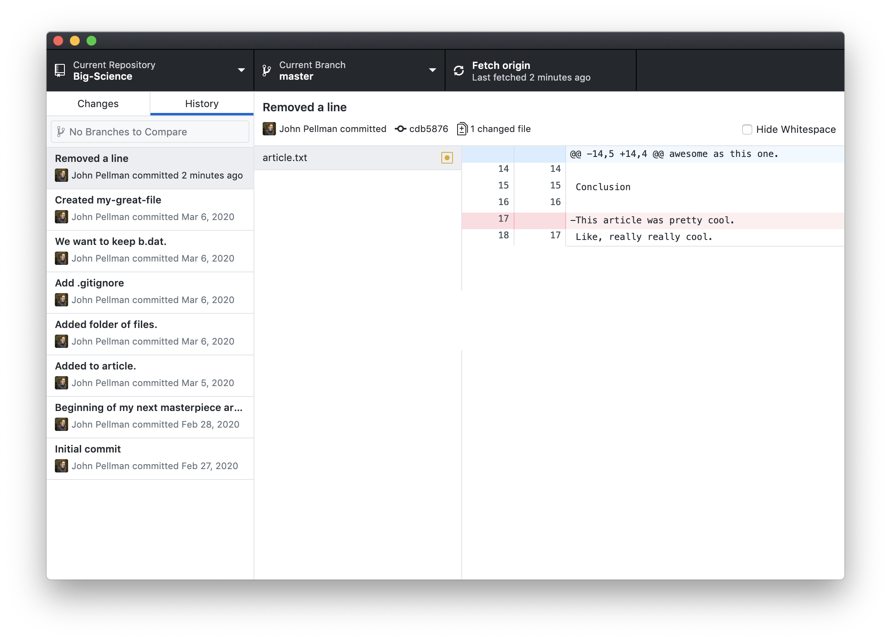
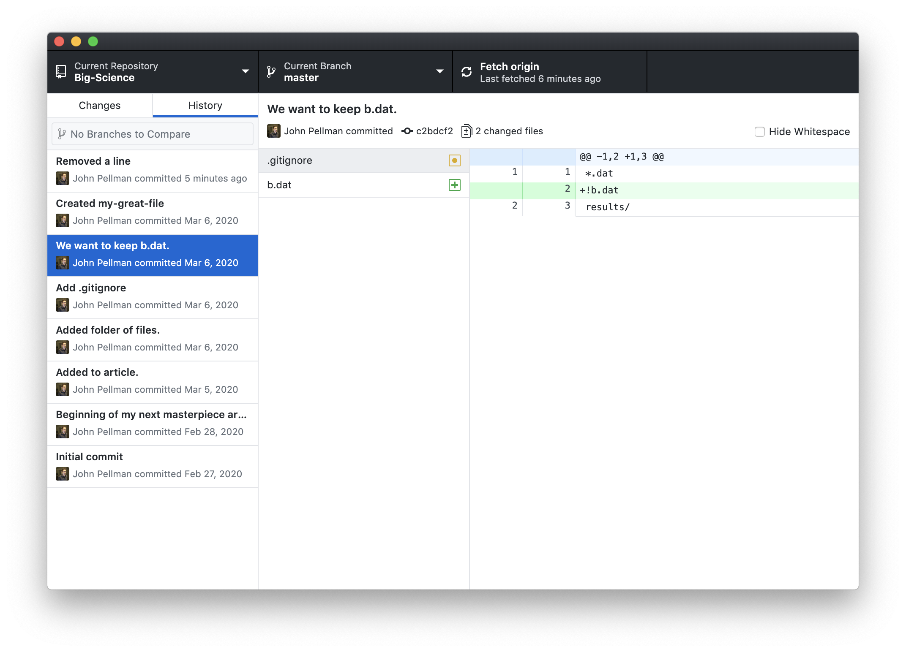
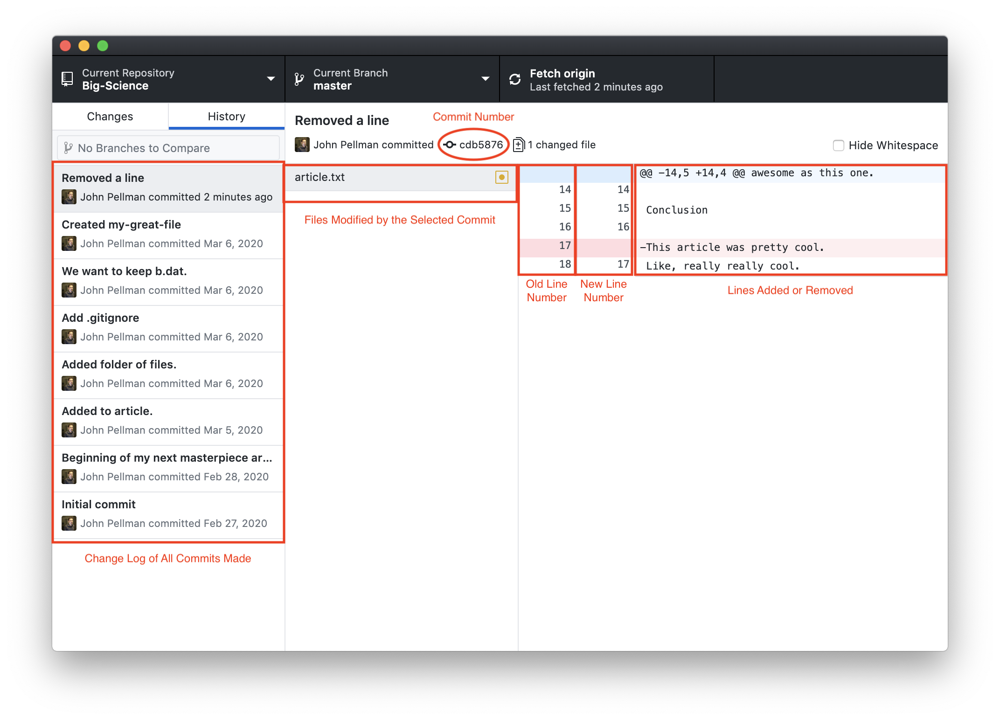
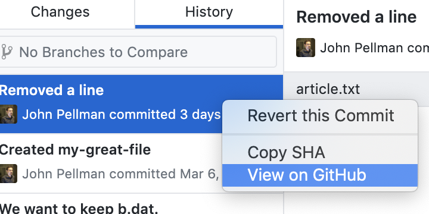
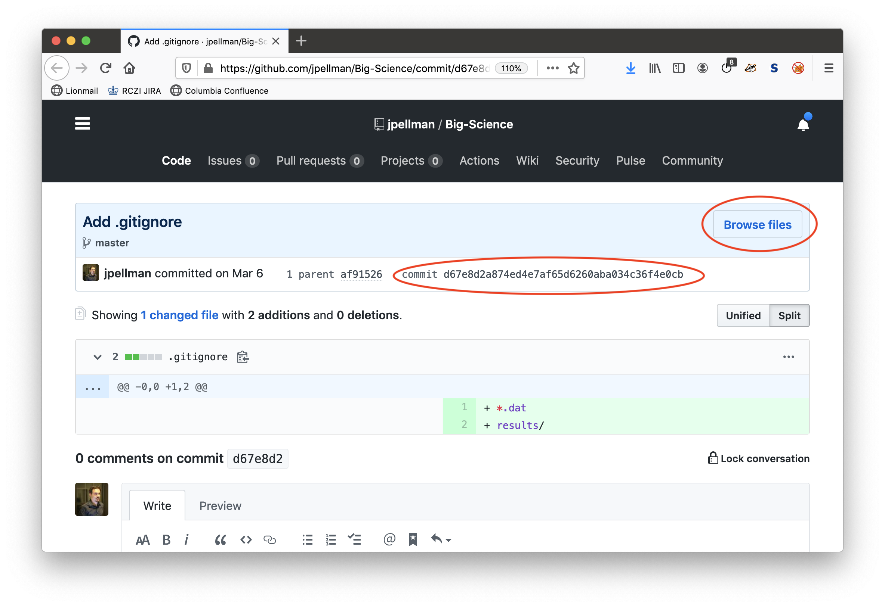
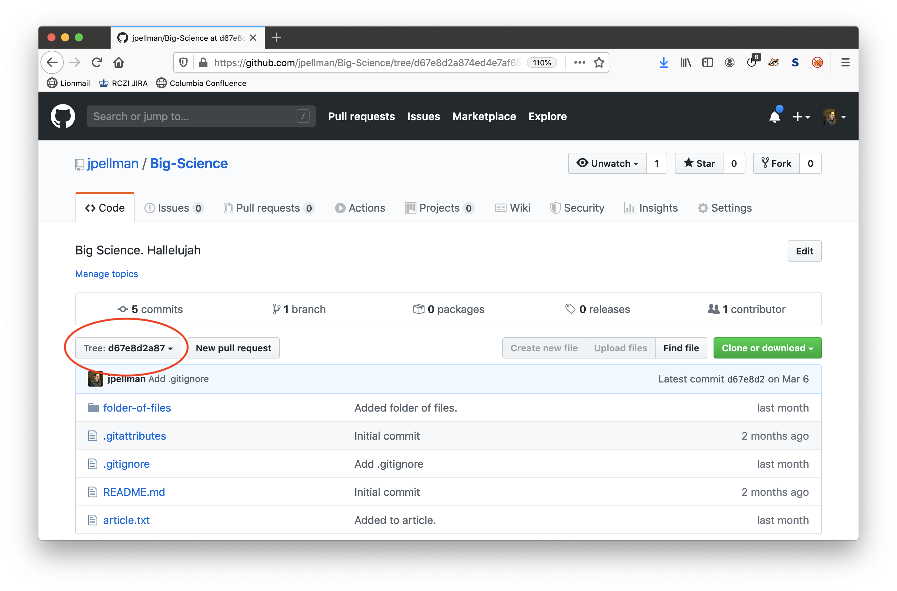

Let's look at the history tab in the GitHub Desktop application (which we went over in section 4, *Tracking Changes*) in a little more detail.

Perhaps we want to remove a line from our article.  If we remove a line and then stage and commit this line removal to our repository, we can visualize that change in the GitHub Desktop application by clicking on the *History* tab in the lefthand side of the window:

Here, we notice that the most recent change we've made (with the commit message "Removed a line") is highlighted in the leftmost pane.  In the middle pane, a list of all files that were modified by the commit can be seen.  In this case, only one file was modified.  If we click on another commit we've made, we can see a change with multiple files changed:

Returning to the line removal, we notice that in the rightmost pane, there is a table with one row highlighted in red.  The row highlighted in red represents the line removed, and the `-` prefixed to the line in its third column indicates that it was removed.  When lines are added to a document, they are instead highlighted in green and prefixed with a `+`.

In the first column, we see the line numbers for the document from before the line was removed.  In the second column, we see the line numbers after we made our change.  In this example, line 18 from our original document has become line 17 in the new version.

As mentioned in section 4, each commit has a unique alphanumeric code associated with it that can be used to uniquely and unambiguously identify changes that have been made.  This code can be found immediately below the topmost pane in the GitHub Desktop interface.

To summarize, the following information is given by the history tab:

If we right-click on a commit in the righthand pane, we are presented with several options:

 * *Revert this Commit* will undo all of the changes that were done in this commit, meaning that all the lines that were added across all modified files will be removed, and all lines that were removed will be restored.  This can be used to undo changes for any given commit, even if the commit was made far back in the repository's history.
 * *Copy SHA* will copy the unique alphanumeric identifier associated with this commit to your clipboard.  This can be helpful if you need to unambiguously refer to a commit in a communication, such as a pull request or email (for example, if a colleague or reviewer wants to know the exact version of a codebase that you used to run an analysis).
 * *View On GitHub* will show the same information currently visible in the GitHub Desktop application, but on the GitHub website.  This can be useful if you need to share a link with a colleague or reviewer indicating what changes were made to your code or paper.

Viewing the differences between an old and new version of a file on the GitHub website instead of in the GitHub desktop application also gives you the ability to browse the directory structure of your Git repository at a specific point in time.  After you click on *View on GitHub* click on the *Browse files* button on the GitHub website; also note the commit identifier:

Afterwards, you will be presented with a browsable file tree.  You can verify that you are browsing the state of the repository when a given commit was taken by checking that the commit number is selected in the lefthand dropdown:

