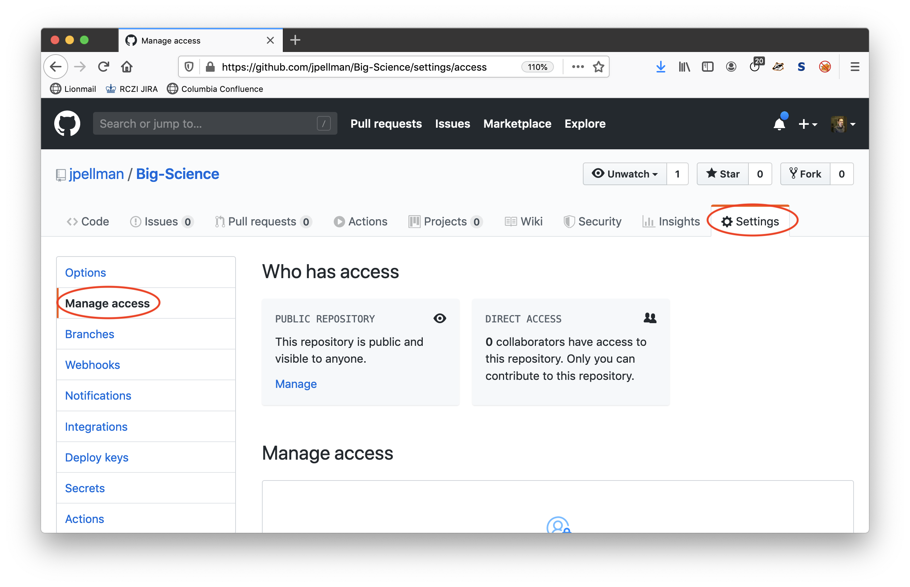
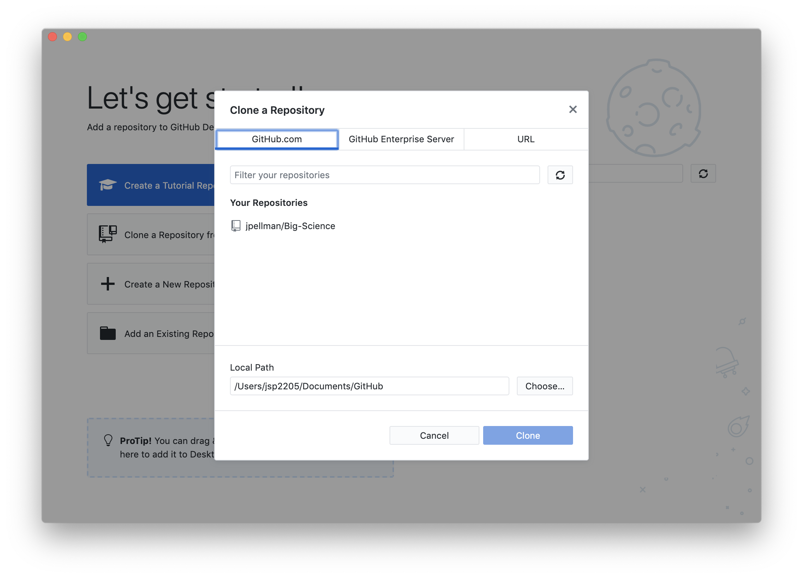
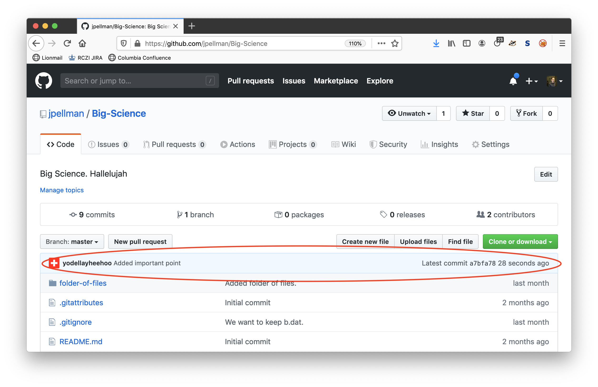

Imagine that you want to collaborate with a colleague on a paper or software project.  With GitHub, there are two workflows you can use to collaborate with other researchers with GitHub accounts- a workflow where colleagues have direct read/write access to your repository, and one where you can review proposed changes before adding them to your code base.  Let's go over both workflows using a few hypothetical examples.

## Direct Access Workflow

In a direct access workflow, the owner of a repository on GitHub (i.e., the person whose GitHub account the repository lives under) grants the ability to push changes (commits) directly to a collaborator.  This workflow is ideal for close collaborators that you have high trust in, and whom you expect to update your paper or codebase regularly without consulting you.

For instance, let's say that I want another researcher named Laurie to collaborate on the `Big-Science` repository containing my article.  I would first navigate to my repository on GitHub by selecting my repository in the GitHub Desktop interface, and then clicking the `Repository` dropdown at the top of the window or screen and selecting `View on GitHub` (this can also be accomplished by typing <kbd>Shift</kbd> - <kbd>Command</kbd> - <kbd>G</kbd> on Mac OS X).  At the time of writing (April 2020), I would then click the `Settings` button on the right on the right of the page, then select `Manage access` in the lefthand pane, scroll down, click the green `Invite a collaborator` button and enter Laurie's username, full name, or email address.  If you do not see any of these buttons or dropdowns, consult the latest official GitHub documentation [here](https://help.github.com/en/github/setting-up-and-managing-your-github-user-account/inviting-collaborators-to-a-personal-repository).

Laurie will now receive an email inviting her to collaborate on this repository. To accept access to the my repository, Laurie will need to follow a link within that email and accept access to `Big-Science`.

Next, Laurie will need to download a copy of `Big-Science` to her machine. This is called "cloning a repository". To clone `Big-Science` with the GitHub Desktop application, Laurie can navigate to `File` -> `Clone Repository...` or type <kbd>Shift</kbd> - <kbd>Command</kbd> - <kbd>O</kbd> on Mac OS X.  She will then be presented with a dialogue containing all the repositories she has access to, where she can select `Big-Science` and press the blue `Clone` button to continue.

Laurie can now make a change in her clone of `Big-Science`, using the same methods from sections 2-6 of this workshop.  When she's finished and has pushed her changes to the remote named `origin`, we will see them reflected in GitHub:

To download Laurie's changes from GitHub, I can then fetch the changes by clicking *Fetch origin* (as per section 6), and then download them by clicking *Pull origin*.

Now the three copies of the repository (my local copy, Laurie's local copy, and the remote copy on GitHub) are synchronized.

## Code Review Workflow

**TODO**
