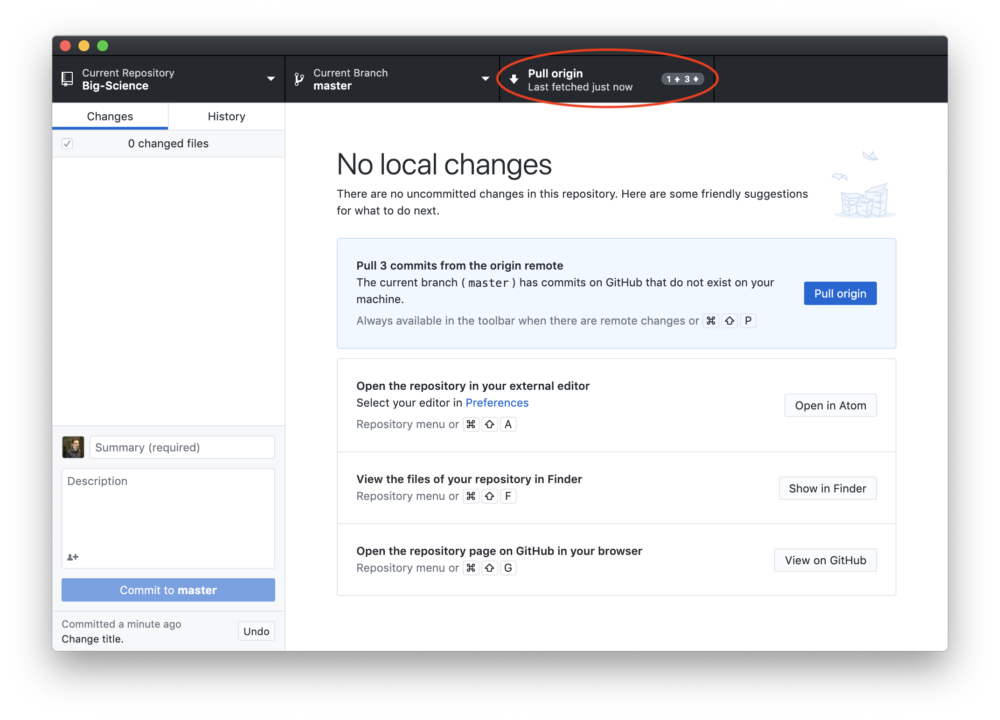
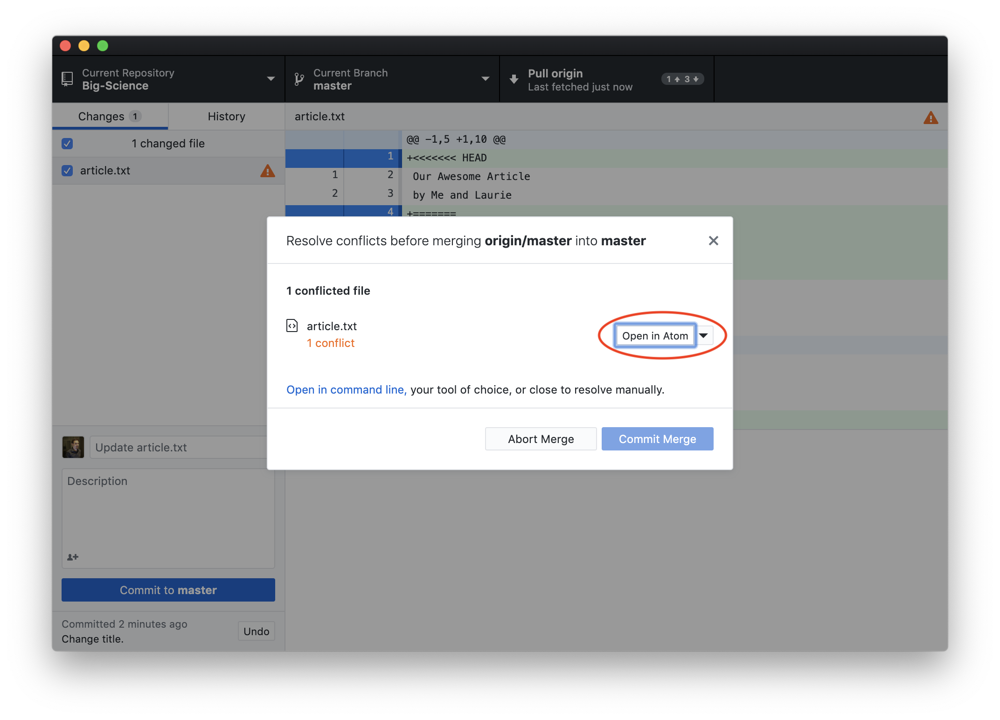
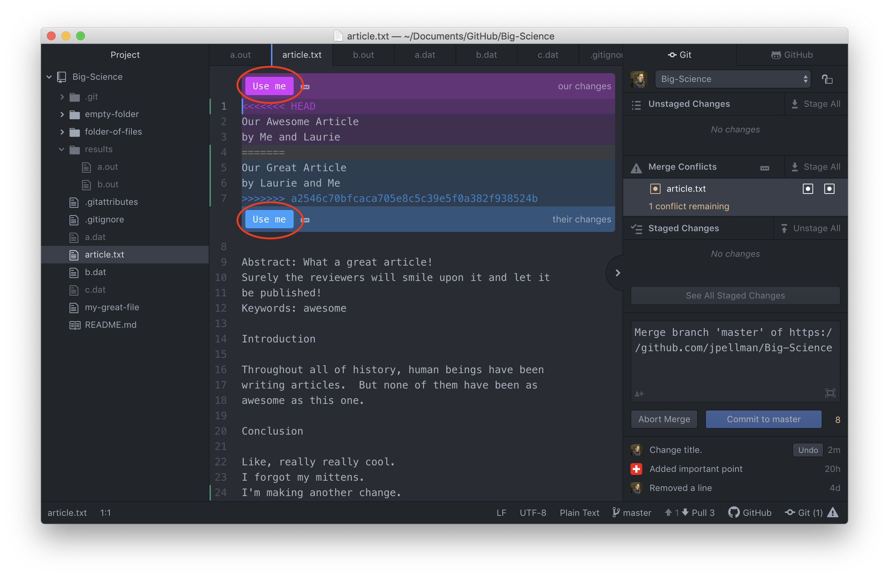
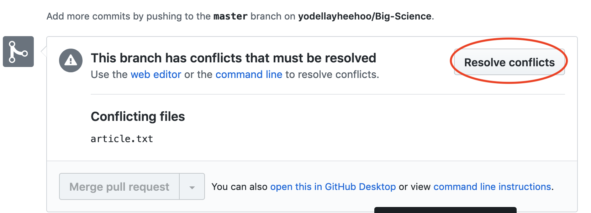
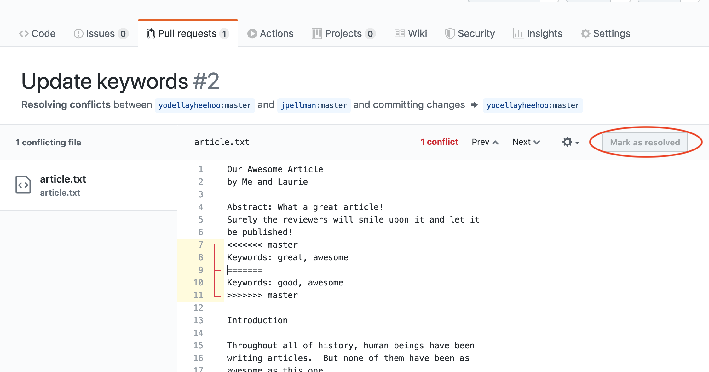

As soon as people can work in parallel, they'll likely step on each other's
toes.  This will even happen with a single person: if we are working on
a piece of software on both our laptop and a server in the lab, we could make
different changes to each copy.  Version control helps us manage these
[conflicts]({{ page.root}}#conflict) by giving us tools to
[resolve]({{ page.root }}#resolve) overlapping changes.

To see how we can resolve conflicts, we must first create one.  We will assume that Laurie and I are using the direct access workflow from the last section- this means that there is only one remote copy that Laurie and I both have access to, and two local copies on each of our computers.  Let's start by establishing the current state of the article Laurie and I are collaborating on.  Presently, it is the same for both of us and appears as follows.

~~~
My Great Article
by Me

Abstract: What a great article!
Surely the reviewers will smile upon it and let it
be published!
Keywords: awesome

Introduction

Throughout all of history, human beings have been
writing articles.  But none of them have been as
awesome as this one.

Conclusion

Like, really really cool.
I forgot my mittens.
I'm making another change.
~~~

The article's stated authorship is no longer accurate, so Laurie is going to update her copy and push it to the remote copy with the following changes:

~~~
Our Great Article
by Laurie and Me
~~~

At the same time, however, I've decided to do the same thing to my local copy.  Since I don't know that Laurie is making a change, I haven't copied changes down from the remote copy.

~~~
Our Awesome Article
by Me and Laurie
~~~

After I make the change, I stage and commit it to my local copy.  Before  I try to upload it to the remote copy, however, I notice that there are some changes that need to be downloaded (pulled) to my local repository.

If we pull these changes, GitHub desktop detects that the remote repository has new updates that conflict with the changes we've already committed / taken a snapshot of.
We need to find a way to reconcile, or
[merge]({{ page.root }}#merge), these updates into the copy we're currently working in, and then push that.  The diagram below illustrates this scenario:

Let's first take a look at where the conflict lies by opening up the affected document in Atom by clicking `Open in Atom`.

After we've opened our article in Atom, we can see where the conflict occurs.  My change is preceded by `<<<<<<< HEAD`.
Git has then inserted `=======` as a separator between the conflicting changes
and marked the end of the content downloaded from GitHub with `>>>>>>>`.
(The string of letters and digits after that marker
identifies the commit we've just downloaded.)

We are presented with three options- we can either use our changes, Laurie's changes, or we can rewrite the title anew.  If we want to use either our changes or Laurie's changes, we can click one of the `Use me` buttons.  

Once we've reconciled the differences between the two versions, we can stage the article again, commit our changes to our local repository, and finally push the reconciled changes up to the remote copy on GitHub.

Reconciling differences with the code review workflow is similar, but inconsistencies aren't detected until a pull request is up for consideration.  When Laurie creates her pull request, however, she will be able to see that it can't be merged automatically.

At the end of the pull request, there will be a button that either I or Laurie can click to reconcile our incompatible changes:

This will bring us to an editor where we can make necessary edits to harmonize our changes.  When we're done, we click the `Mark as Resolved` button, followed by the `Commit merge`, and `I understand` buttons.  I can then review the pull request and accept it into the main repository as though it were a non-conflicting change.

Git's ability to resolve conflicts is very useful, but conflict resolution
costs time and effort, and can introduce errors if conflicts are not resolved
correctly. If you find yourself resolving a lot of conflicts in a project,
consider these technical approaches to reducing them:

- Download (pull) from the remote copy more frequently, especially before starting new work
- Make smaller, more atomic commits
- Where logically appropriate, break large files into smaller ones so that it is
  less likely that two authors will alter the same file simultaneously

Conflicts can also be minimized with project management strategies:

- Clarify who is responsible for what areas with your collaborators
- Discuss what order tasks should be carried out in with your collaborators so
  that tasks expected to change the same lines won't be worked on simultaneously
- If the conflicts are stylistic churn (e.g. tabs vs. spaces), establish a
  project convention that is governing and use code style tools (e.g.
  `htmltidy`, `perltidy`, `rubocop`, etc.) to enforce, if necessary.
